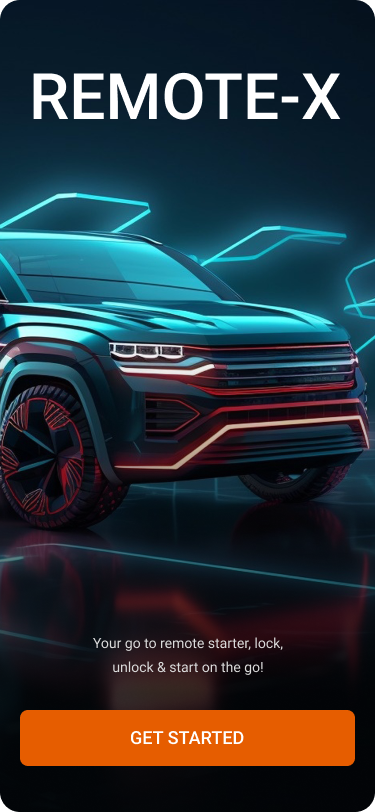
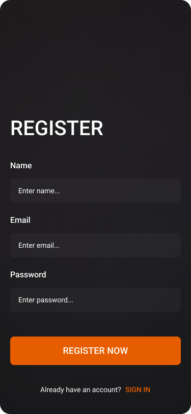
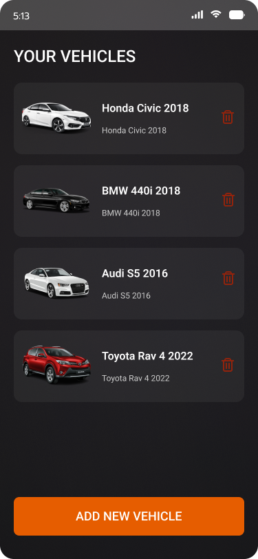
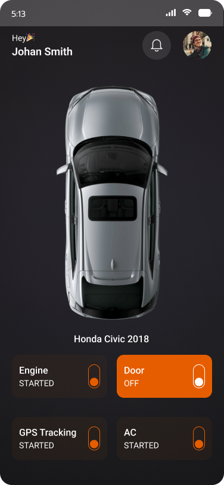
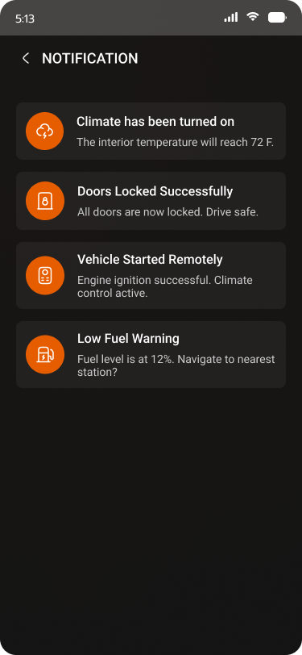
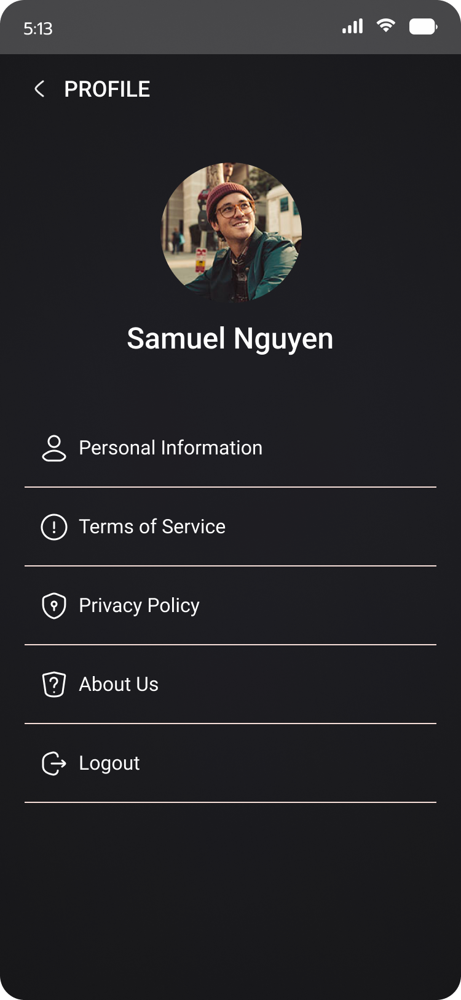

# 🚗 Car Remote Starter App

A Flutter-based mobile application that allows users to remotely start, stop, and interact with their car via an intuitive UI. Built to simulate a connected car experience right from your phone.

## 📱 Features

- 🔑 Lock/Unlock Car Doors
- 🔁 Remote Start/Stop Engine
- 🌡️ Display Car Interior/Exterior Temperature (Simulated)
- ⚡ Battery Status Monitoring
- 📸 Screens with Interactive Car Visualization

## 📷 Screenshots









## 🛠️ Tech Stack

- **Flutter** for cross-platform development
- **Dart** as the main programming language
- **Platform Channels** for iOS/Android functionality
- **Custom UI** with animated car components

## 🚀 Getting Started

### Prerequisites

- [Flutter SDK](https://flutter.dev/docs/get-started/install)
- Android Studio or Xcode for emulator/device testing

### Installation

```bash
git clone https://github.com/24M4/Vehicle-Remote-Starter.git
cd Vehicle-Remote-Starter
flutter pub get
flutter run
